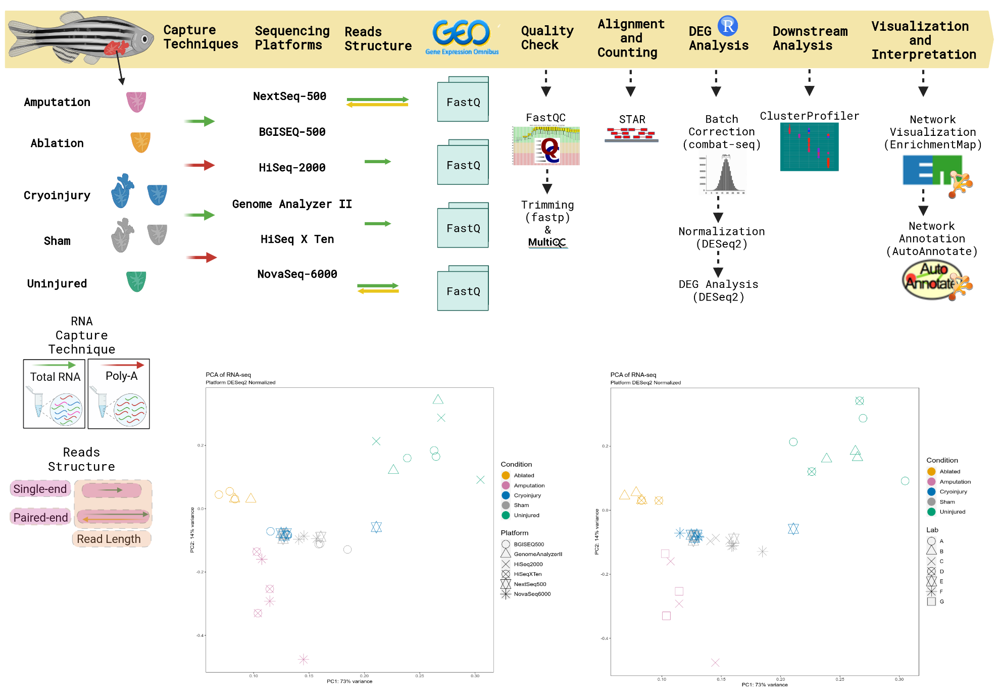
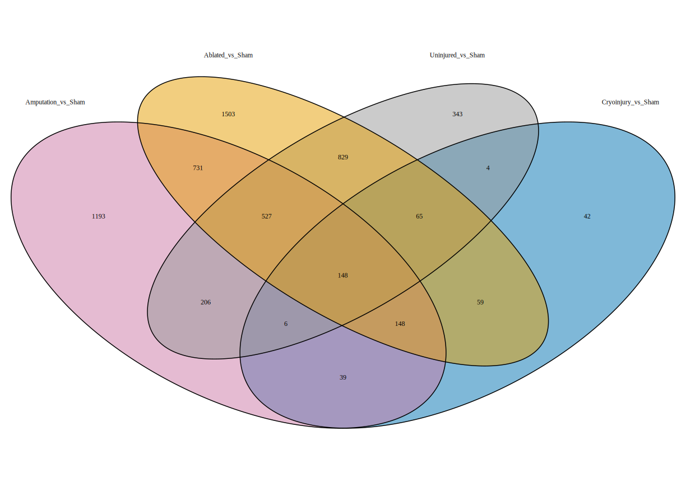

# Heart Injury Models --->

This is intented to be a little interactivity support to play with the Clusters of Biological Processes and Genes involved in each Model and the comparisons realised.

*Still can be improved much more*

