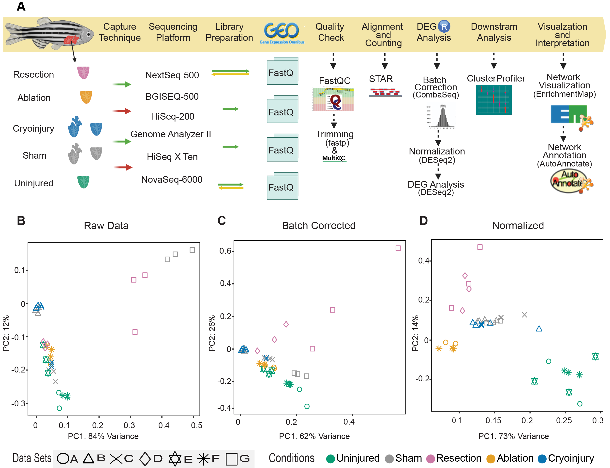
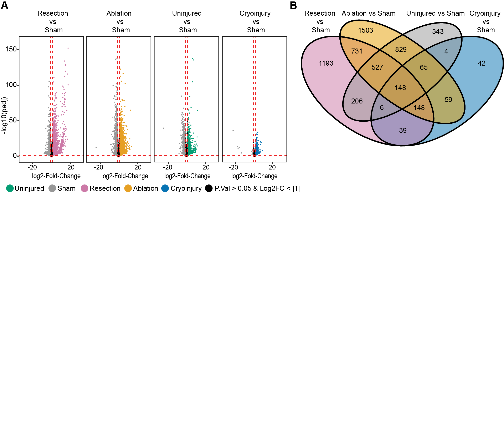
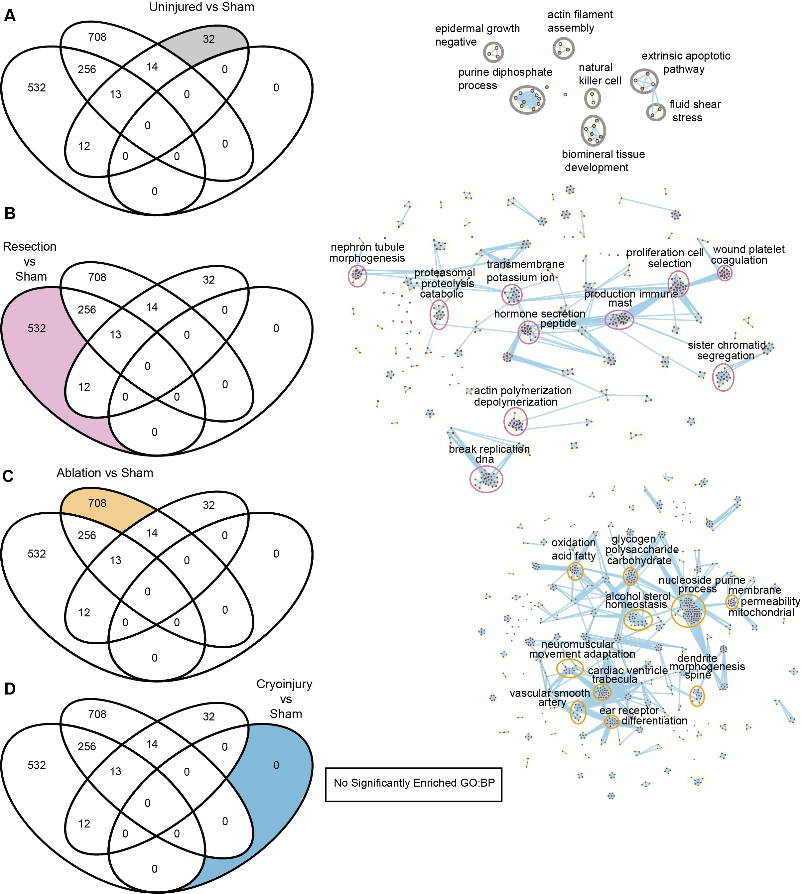
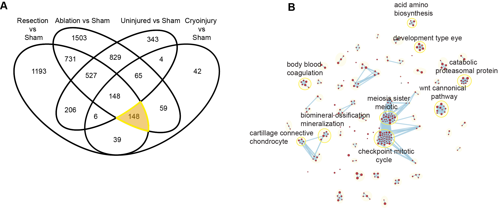

# Heart Injury Models Graphs Analysis

Results combining the genes and the processes enriched when studying the speicific genes in each injury model.

### How to use it:
* **1:** Select the comparison you are interested in.
* **2:** In the left corner a selection of clusters that we obtained from the network display after using Cytoscape and the tools available for clustering the GO:BP is available.
* **3:** Now the cluster is selected you can explore each GO:BP NNNNNNN term and see which genes are selected from the dataset
* **4:** There is also an option to check the counts values expression of the genes that are selected in the GO:BP
* **5:** That is it.

### Brief description and graphs.

####The workflow implemented in the meta-analysis for this project.

**The DEG (differentially expressed genes involved for each comparison when we look at the volcano plot. The DEGs for each comparison are compared all together to find which are the specific genes to each.**

#### Here we find the Volcano plot and the VennDiagram of the comparisons together

**With the specific genes for each comparison when compared all together are used for an Over Representation Analysis (ORA) using GO:BP. With these GO:BP terms we imported them into Cytoscape. Further clustering and wordcloud tag were added using tools available in the Cytoscape environment.**

#### There are for eachc comparison a specific network of GO:BP's

### Here are the core regeneration differentially expressed genes enriched and analyzed in Cytoscape.
**Further from the previous DEGs, we selected the genes that are shared between the 3 injury models and applied the same workflow as described above obtaining a specific network of GO:BP.**

*PS:* **the genes found differentially expressed in *Danio rerio* were converted to the correspondent orthologues in *Mus musculus* and used for the whole analysis in the ORA.**

